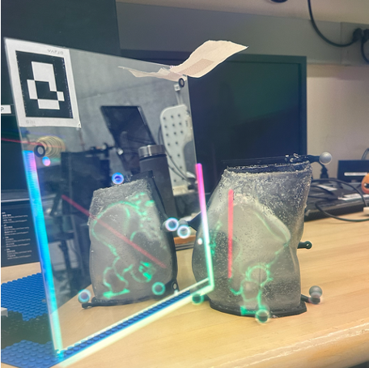
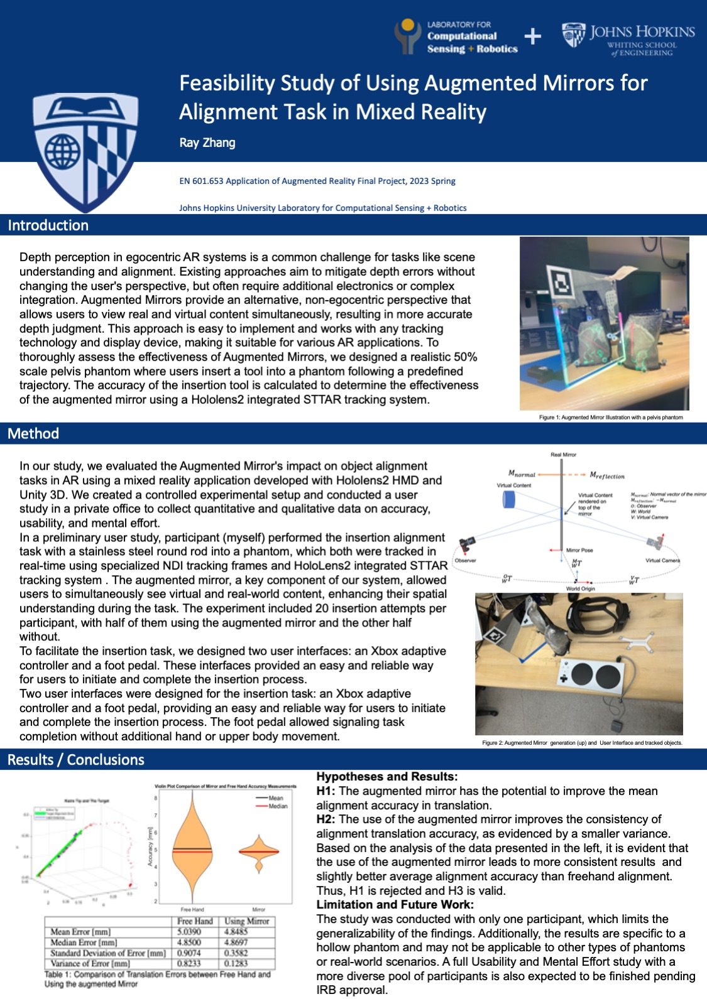

 <h2 align="center">Augmented Mirror</h3>
<h3 align="center">EN.601.653 Augmented Reality Application</h3>
<h4 align="center">Johns Hopkins Computer Science / Robotics</h4>
<p align="center">
  
</p>

  
## Project Poster
<p align="center">
  
</p>

## Getting Started:

This repo showcased the experiment setup of a preliminary feasibility user study of using augmented mirror for alignment tasks in mixed reality.

## What's included
```text
Assets/
├── HoloLensIRTracking/
├── Scenes/
├── Prefab/
├── Scripts/
├── Materials/
└── Models/
```

####  HoloLensIRTracking
Here we used the STTAR Tracking system to track the phantom, mirror and the insertion tool. You can redefine the trackable makers geometry setting and track whatever object you would like by changing the parameter controller object inside Unity3D. 
#### Scripts
* MirrorCameraMover.cs: This file generates the virtual camera which renders the mirrored object onto the Hololens2.
* Logger.cs: Multiple logger files log differnt objects poses for data analysis. 
* Input_MRTK_Implementation.cs: User interface implemented using Xbox adaptive controller/ foot pedal. 
#### Prefab & Models
In these folders we included the object files for the mirror/phantom and insertion tool. 